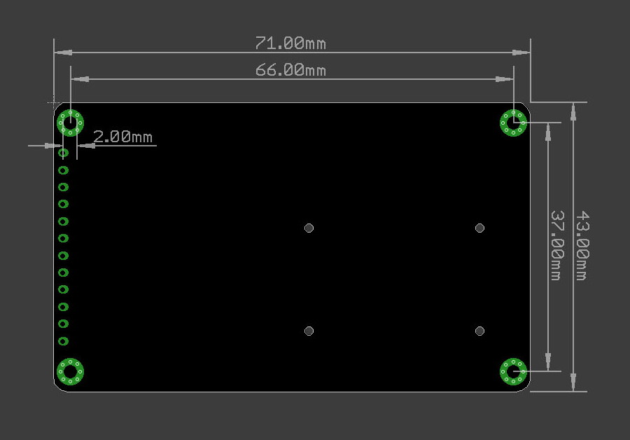

# AZ-Touch

        
        

        <a href="https://raw.githubusercontent.com/HASwitchPlate/openHASP-docs/master/docs/assets/images/devices/esp32-touchdown-usbc.jpg" data-toggle="lightbox" data-gallery="example-gallery" rel="lightbox[work]" data-title="ESP32 TouchDown" data-footer="Original image by Dustin Watts - Used with permission">more images...</a>
        
        
        

The AZ-Touch wall enclosure set comes with a 2.4" or 2.8" ILI9341 display and uses a XPT2046 resistive touchscreen controller.
The kit comes with a pre-soldered PCB, but with loose headers.
There are 2 ESP32 footprint options for soldering headers onto the PCB:

1. Plug a compatible ESP32 onto the female headers on the back
2. Attach a [LOLIN D32 Pro V2.0][3] using the 10-pin TFT connector and cable
3. Solder headers onto the bottom pinholes for pluging into a breadboard or jumper cables for any other ESP

| Pros                       | Cons
|:-----                      |:----
| Versatile PCB options      | Big enclosure
| Limited soldering required | Resistive touchpanel
| Choice of several ESP32 MCUs |
| 9 to 35V DC power input    |
| Integrated piezo beeper
| Breadboard area 

## ESP32 dev boards

The AZ-Touch MOD PCB is plug-and-play compatible with these development boards, no need to use any jumper cables:

| Board                   | [D1 Mini ESP32][1] | [TTGO T7 V1.5 Mini32 ESP32][2] | [ESP32-DevKitC-V4][3] | [ESP32-DevKitC-VE][4]
|-------------------------|:-------:|:-------:|:--------:|:--------:
| MCU                     | ESP32-WROOM | ESP32-WROVER | ESP32-WROOM | ESP32-WROVER
| Flash                   | 4 MB    | 4 MB   | 4 MB | 8 MB
| PSram                   | No      | 8 MB    | 8 MB      | 8 MB
| Pinheaders              | Two 1x8 ² | Two 1x8 ² | Two 1x19  | Two 1x19
| Battery circuit         | no | :white_check_mark: yes | no | no
| USB Chip                | | CH9102F | CH340C |
| | [:material-cart-variant: Buy][1]{ .md-button .md-button--primary } | [:material-cart-variant: Buy][2]{ .md-button .md-button--primary } | [:material-cart-variant: Buy][3]{ .md-button .md-button--primary } | [:material-cart-variant: Buy][4]{ .md-button .md-button--primary }

!!! warning
    The D1 Mini ESP32 board may suffer from brown-out reboots if not powered adequately.

!!! note
    (²) Because the board is developed for the D1-mini, you must *only* solder a row of 1x8 male pins to pads `TXD-5V` and `RST-3V3` each.

## Product Video

## Backlight Control

To use PWM dimming on the Lolin TFT 2.4" you must connect the TFT-LED pin to either D1 or D2.
**D1 is recommended** for backlight control and configured by default in the firmware.

!!! warning
    Do *not* use D3 for backlight control because it is already in use for touch! 
    Do *not* use D4 for backlight control because it is already in use for PSram on the ESP32-WROVER,
    also the D1-mini has D4 connected to the on-board LED and boot fails if pulled LOW

## Enclosure

AZ-Touch comes with a nice wall mounting enclosure for the 2.4&quot; or 2.8&quot; touchscreen.
It enables you to mount your project permanent in your living room, corridor or other exposed places. 

The wall mounted enclosure measures 120mm x 80mm x 35mm (W x H x D).

## Flashing

The ESP32 can be flashed over USB like any ESP32 development board.

## Documentation

[:fontawesome-solid-file-pdf: Schematics][6]{ .md-button .md-button } &nbsp;
[:fontawesome-regular-file-pdf: Datasheet][7]{ .md-button .md-button }

## Dimensions

[1]: https://www.aliexpress.com/item/32815530502.html
[2]: https://www.aliexpress.com/item/32977375539.html
[3]: https://www.az-delivery.de/nl/products/esp-32-dev-kit-c-v4
[4]: https://www.amazon.com/Espressif-ESP32-DevKitC-VE-Development-Board/dp/B087TNPQCV
[5]: https://www.aliexpress.com/item/32848833474.html
[6]: https://www.hwhardsoft.de/app/download/11868165697/AZ-Touch+MOD+schematic+V01-03-01.pdf
[7]: https://www.hwhardsoft.de/app/download/11868164297/Datasheet+AZ-Touch+MOD+Rev+B.pdf